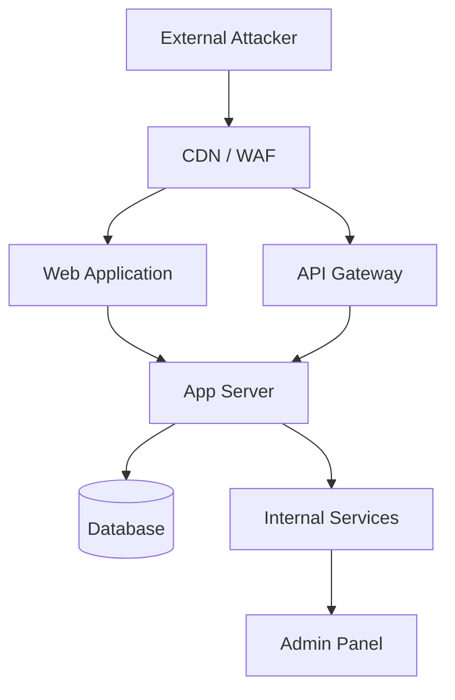

# Report Templates — Agentic Pentest Skill
# Pre-formatted templates for Markdown and JSON output

## Table of Contents
1. [Full Pentest Report (Markdown)](#1-full-pentest-report-markdown)
2. [Executive Summary Template](#2-executive-summary-template)
3. [Individual Finding Template (Markdown)](#3-individual-finding-template-markdown)
4. [Individual Finding Template (JSON)](#4-individual-finding-template-json)
5. [Attack Chain Narrative Template](#5-attack-chain-narrative-template)
6. [Remediation Roadmap Template](#6-remediation-roadmap-template)
7. [Retest Checklist Template](#7-retest-checklist-template)
8. [Scope Confirmation Template](#8-scope-confirmation-template)
9. [Engagement Log Template](#9-engagement-log-template)
10. [DefectDojo / Jira Import Format](#10-defectdojo--jira-import-format)

---

## 1. Full Pentest Report (Markdown)

```markdown
---
title: "[CLIENT NAME] Penetration Test Report"
author: "[CONSULTANT NAME] — [FIRM NAME]"
date: "[DATE]"
engagement-id: "[ENG-YYYY-NNN]"
classification: CONFIDENTIAL
---

# [CLIENT NAME] Penetration Test Report

**Classification:** CONFIDENTIAL — Authorized Recipients Only  
**Engagement ID:** [ENG-YYYY-NNN]  
**Test Period:** [START DATE] – [END DATE]  
**Report Date:** [REPORT DATE]  
**Prepared By:** [CONSULTANT NAME], [FIRM NAME]  
**Client Contact:** [NAME], [TITLE]

---

## Table of Contents

1. [Executive Summary](#1-executive-summary)
2. [Engagement Scope & Methodology](#2-engagement-scope--methodology)
3. [Attack Surface Overview](#3-attack-surface-overview)
4. [Summary of Findings](#4-summary-of-findings)
5. [Technical Findings](#5-technical-findings)
6. [Attack Chain Narratives](#6-attack-chain-narratives)
7. [Remediation Roadmap](#7-remediation-roadmap)
8. [Appendices](#8-appendices)

---

## 1. Executive Summary

> *2-page maximum. Written for non-technical stakeholders.*

### Overall Risk Rating: [CRITICAL / HIGH / MEDIUM / LOW]

[CLIENT NAME]'s [ASSET TYPE] was assessed between [DATE RANGE]. The assessment identified **[N] findings**, including **[N] Critical**, **[N] High**, **[N] Medium**, and **[N] Low** severity issues.

### Key Findings

1. **[Finding 1 — Plain Language Title]** — An attacker could [plain-language impact].
2. **[Finding 2 — Plain Language Title]** — An attacker could [plain-language impact].
3. **[Finding 3 — Plain Language Title]** — An attacker could [plain-language impact].

### Recommended Immediate Actions

1. [Action 1 — can be done within 24–48 hours]
2. [Action 2 — can be done within 1 week]
3. [Action 3 — longer term architectural fix]

### Risk Distribution

| Severity   | Count | % of Total |
|-----------|-------|-----------|
| Critical  | [N]   | [%]       |
| High      | [N]   | [%]       |
| Medium    | [N]   | [%]       |
| Low       | [N]   | [%]       |
| Info      | [N]   | [%]       |
| **Total** | **[N]** | 100%    |

---

## 2. Engagement Scope & Methodology

### Scope

**In-Scope Targets:**
| Asset | Type | Notes |
|-------|------|-------|
| [domain/IP] | [Web App / API / Network / Cloud] | [notes] |

**Out-of-Scope:**
- [Explicitly excluded asset or action]

**Authorized Activities:**
- [x] Passive reconnaissance
- [x] Active scanning
- [x] Exploitation (non-destructive)
- [ ] Social engineering
- [ ] Denial of Service
- [ ] Destructive payloads

### Methodology

This assessment followed the **[OWASP WSTG v5 / PTES / NIST SP 800-115]** methodology, progressing through:

1. **Reconnaissance** — Passive and active asset discovery
2. **Scanning** — Vulnerability identification and service enumeration
3. **Exploitation** — Confirmed exploitation of identified vulnerabilities
4. **Post-Exploitation** — Impact demonstration and lateral movement (if authorized)
5. **Reporting** — Documentation of findings with remediation guidance

---

## 3. Attack Surface Overview

### Discovered Assets

| Asset | IP / URL | Technology Stack | Open Ports | Notes |
|-------|----------|-----------------|------------|-------|
| [asset name] | [url/ip] | [stack] | [ports] | [notes] |

### Attack Surface Diagram



---

## 4. Summary of Findings

| ID | Title | Severity | CVSS v4.0 | EPSS | Status |
|----|-------|----------|-----------|------|--------|
| F-001 | [Title] | Critical | [score] | [%] | Open |
| F-002 | [Title] | High | [score] | [%] | Open |
| F-003 | [Title] | Medium | [score] | [%] | Open |

---

## 5. Technical Findings

> *Use individual finding template (Section 3 of this file) for each finding.*

[Findings inserted here, ordered Critical → High → Medium → Low → Info]

---

## 6. Attack Chain Narratives

> *See attack chain template (Section 5 of this file).*

---

## 7. Remediation Roadmap

> *See remediation roadmap template (Section 6 of this file).*

---

## 8. Appendices

### A. Tool List & Evidence Index

| Tool | Version | Usage | Output Files |
|------|---------|-------|-------------|
| Nmap | [ver] | Port scanning | nmap-full.xml |
| Nuclei | [ver] | Vuln scanning | nuclei.json |
| [tool] | [ver] | [usage] | [files] |

### B. Scope Confirmation Document
> *Attach signed scope confirmation (see template Section 8)*

### C. Engagement Log
> *Attach timestamped engagement log (see template Section 9)*
```

---

## 2. Executive Summary Template

```markdown
## Executive Summary

### Assessment Overview

[FIRM NAME] conducted a [ENGAGEMENT TYPE] of [CLIENT NAME]'s [ASSET(S)] between [DATE RANGE].
The assessment was performed by [CONSULTANT NAME(S)] under the terms of the signed Statement of Work
dated [SOW DATE].

### Overall Risk Posture

The overall risk posture is assessed as **[CRITICAL / HIGH / MEDIUM / LOW]**.

[1-2 sentence summary of the most significant issues and their collective business risk]

### Most Critical Finding

**[Finding Title]**: [2-3 sentence plain-language description of what it is, what an attacker could
do with it, and why it matters to the business].

### Positive Observations

The following security controls were observed to be functioning effectively:
- [Positive observation 1]
- [Positive observation 2]

### Recommended Immediate Actions

The following actions should be prioritized within 72 hours:

1. **[Action]** — [Why urgent, how to do it briefly]
2. **[Action]** — [Why urgent, how to do it briefly]
```

---

## 3. Individual Finding Template (Markdown)

```markdown
### F-[NNN] — [FINDING TITLE]

| Field | Value |
|-------|-------|
| **Severity** | [Critical / High / Medium / Low / Info] |
| **CVSS v4.0 Score** | [score] |
| **CVSS Vector** | CVSS:4.0/AV:N/AC:L/AT:N/PR:N/UI:N/VC:H/VI:H/VA:H/SC:N/SI:N/SA:N |
| **EPSS Score** | [%] (probability of exploitation in 30 days) |
| **CWE** | CWE-[NNN]: [CWE Name] |
| **OWASP** | [OWASP Top 10 category if applicable] |
| **Affected Asset** | [URL / IP / Component] |
| **Status** | Open |

#### Description

[Clear, technical description of the vulnerability. What is it? Where does it exist?
What causes it? Avoid jargon where possible — the remediation team needs to understand this.]

#### Business Impact

[Concrete description of what an attacker could achieve if they exploit this.
Frame in terms the client cares about: data breach, financial loss, regulatory fine,
reputational damage, service disruption. Be specific — "an attacker could extract
all payment card numbers from the orders table" is better than "data exposure".]

#### Evidence

**Request:**
```http
POST /api/users/login HTTP/1.1
Host: target.com
Content-Type: application/json

{"username": "admin'--", "password": "x"}
```

**Response:**
```http
HTTP/1.1 200 OK
Content-Type: application/json

{"token": "eyJ...", "user": {"id": 1, "role": "admin"}}
```

> *[Screenshot or additional evidence here]*

#### Reproduction Steps

1. [Step 1 — setup / prerequisites]
2. [Step 2 — specific action]
3. [Step 3 — observe result]
4. [Confirm vulnerability by checking: ...]

#### Remediation

**Priority:** [Immediate (24–48h) / Short-term (1–2 weeks) / Long-term (1–3 months)]

[Clear, actionable fix description. Explain *why* the fix works, not just *what* to do.]

**Code Fix:**

```[language]
// VULNERABLE
[vulnerable code snippet]

// FIXED
[fixed code snippet]
```

**Configuration Fix** (if applicable):
```[format]
[config snippet]
```

#### References

- [CVE-YYYY-NNNN](https://nvd.nist.gov/vuln/detail/CVE-YYYY-NNNN)
- [CWE-NNN](https://cwe.mitre.org/data/definitions/NNN.html)
- [OWASP Reference](https://owasp.org/...)
```

---

## 4. Individual Finding Template (JSON)

```json
{
  "id": "F-001",
  "title": "SQL Injection in Login Endpoint",
  "severity": "Critical",
  "cvss_v4": {
    "score": 9.3,
    "vector": "CVSS:4.0/AV:N/AC:L/AT:N/PR:N/UI:N/VC:H/VI:H/VA:H/SC:N/SI:N/SA:N"
  },
  "epss": {
    "score": 0.94,
    "percentile": 0.98
  },
  "cwe": "CWE-89",
  "owasp": "A03:2021 - Injection",
  "affected_asset": "https://target.com/api/auth/login",
  "status": "Open",
  "description": "The login endpoint constructs SQL queries using unsanitized user input, allowing an attacker to manipulate the query logic.",
  "business_impact": "An unauthenticated attacker can bypass authentication and gain administrative access to all user accounts and payment data.",
  "evidence": {
    "request": "POST /api/auth/login HTTP/1.1\nHost: target.com\n\n{\"username\":\"admin'--\",\"password\":\"x\"}",
    "response": "HTTP/1.1 200 OK\n\n{\"token\":\"eyJ...\",\"user\":{\"id\":1,\"role\":\"admin\"}}",
    "screenshots": []
  },
  "reproduction_steps": [
    "Send POST request to /api/auth/login",
    "Set username to: admin'--",
    "Set any value for password",
    "Observe: 200 OK response with admin token"
  ],
  "remediation": {
    "priority": "Immediate",
    "description": "Use parameterized queries or prepared statements for all database interactions.",
    "code_fix": {
      "language": "python",
      "vulnerable": "query = f\"SELECT * FROM users WHERE username = '{username}'\"",
      "fixed": "result = db.execute(text(\"SELECT * FROM users WHERE username = :u\"), {\"u\": username})"
    }
  },
  "references": [
    "https://cwe.mitre.org/data/definitions/89.html",
    "https://owasp.org/www-project-top-ten/2021/A03_2021-Injection"
  ],
  "engagement_id": "ENG-2026-001",
  "discovered_date": "2026-03-15",
  "discovered_by": "Consultant Name"
}
```

---

## 5. Attack Chain Narrative Template

```markdown
## Attack Chain: [CHAIN NAME]

**Overall Severity:** [Critical / High]  
**Findings Involved:** F-[NNN], F-[NNN], F-[NNN]  
**Estimated Time to Exploit:** [minutes / hours]  
**Prerequisites:** [None / Valid user account / VPN access / etc.]

### Narrative

An unauthenticated external attacker could chain [Finding A] with [Finding B] to achieve
[final impact] without any prior knowledge of the system.

**Step 1 — Initial Access via [Finding A]**
[Describe the first step: what the attacker does and what they gain access to]

**Step 2 — Privilege Escalation via [Finding B]**
[Describe how they leverage the first access to escalate]

**Step 3 — Impact Achievement**
[Describe the final impact: what they exfiltrate, what they can do, what damage is caused]

### Blast Radius

If this chain were successfully exploited by a real attacker:
- **Data at risk:** [List types of data that could be accessed or exfiltrated]
- **Systems at risk:** [List systems that could be compromised]
- **Business impact:** [Revenue loss, regulatory exposure, reputational damage]
- **Recovery time estimate:** [Days / Weeks / Months]

### Mitigations

Remediating any one of the following findings would break this chain:
- Remediating **F-[NNN]** would prevent Step 1
- Remediating **F-[NNN]** would prevent Step 2
```

---

## 6. Remediation Roadmap Template

```markdown
## Remediation Roadmap

### Priority Matrix

| Priority | Timeframe | Criteria |
|----------|-----------|---------|
| P1 — Immediate | 24–72 hours | Critical findings, easily exploitable, direct business impact |
| P2 — Short-term | 1–2 weeks | High findings, or medium with high EPSS |
| P3 — Medium-term | 1 month | Medium findings, architectural improvements |
| P4 — Long-term | 1–3 months | Low findings, security hardening, policy changes |

### P1 — Immediate Actions (24–72 hours)

- [ ] **F-001 [Finding Title]** — [One-line fix description] — Owner: [Team]
- [ ] **F-002 [Finding Title]** — [One-line fix description] — Owner: [Team]

### P2 — Short-term (1–2 weeks)

- [ ] **F-003 [Finding Title]** — [One-line fix description] — Owner: [Team]
- [ ] **F-004 [Finding Title]** — [One-line fix description] — Owner: [Team]

### P3 — Medium-term (1 month)

- [ ] **F-005 [Finding Title]** — [One-line fix description] — Owner: [Team]

### P4 — Long-term (1–3 months)

- [ ] [Architectural improvement or policy change]

### Quick Wins vs. Structural Fixes

**Quick wins (low effort, high impact):**
- [Example: Enable MFA on admin accounts — 30 minutes, eliminates credential stuffing risk]

**Structural fixes (higher effort, systemic improvement):**
- [Example: Migrate from string interpolation to ORM for all DB queries — 1 week, eliminates SQLi class]
```

---

## 7. Retest Checklist Template

```markdown
## Retest Checklist — [CLIENT NAME] — [DATE]

**Retested By:** [Name]  
**Original Engagement:** [ENG-YYYY-NNN]  
**Retest Date:** [Date]

| Finding ID | Title | Original Severity | Fix Applied | Retest Result | Notes |
|-----------|-------|------------------|-------------|--------------|-------|
| F-001 | [Title] | Critical | [Fix description] | ✅ Resolved / ❌ Still Present / ⚠️ Partially Fixed | [notes] |
| F-002 | [Title] | High | [Fix description] | ✅ Resolved | |

### New Issues Found During Retest

> *Note any new issues discovered during retest validation (must be separately scoped/authorized)*

| Title | Severity | Notes |
|-------|---------|-------|
| [title] | [severity] | [notes] |
```

---

## 8. Scope Confirmation Template

```markdown
# Scope Confirmation — [ENGAGEMENT ID]

**Date:** [DATE]  
**Client:** [CLIENT NAME]  
**Consultant:** [NAME], [FIRM]

## Confirmed In-Scope Targets

| Target | Type | IP Range / URL | Authorized Actions |
|--------|------|---------------|-------------------|
| [name] | [type] | [ip/url] | Recon, Scan, Exploit (non-destructive) |

## Explicitly Out-of-Scope

- [Asset or action explicitly excluded]

## Authorized Activities

- [x] Passive reconnaissance
- [x] Active scanning (non-destructive)
- [x] Exploitation of discovered vulnerabilities
- [ ] Social engineering / phishing
- [ ] Denial of service
- [ ] Data exfiltration beyond PoC demonstration
- [ ] Persistence mechanisms

## Emergency Contact

**Client Emergency Contact:** [Name] — [Phone] — [Email]  
**Engagement Stop Phrase:** "[AGREED STOP PHRASE]"

## Jurisdiction

Primary jurisdiction: [COUNTRY / STATE]  
Relevant laws flagged: [CFAA / Computer Misuse Act / BD DSA / GDPR / other]

---

*Confirmed by: [CLIENT SIGNATURE]  
Date: [DATE]*
```

---

## 9. Engagement Log Template

```markdown
# Engagement Log — [ENGAGEMENT ID]

| Timestamp (UTC) | Phase | Action | Tool / Method | Result | Notes |
|----------------|-------|--------|--------------|--------|-------|
| 2026-03-15 09:00 | Recon | Subdomain enum | subfinder, amass | 47 subdomains found | See subdomains.txt |
| 2026-03-15 09:30 | Recon | Secret scan | trufflehog | 2 verified secrets | See trufflehog.json |
| 2026-03-15 10:00 | Scanning | HTTP probing | httpx, nuclei | 12 live hosts, 3 nuclei findings | See nuclei.json |
| 2026-03-15 11:00 | Exploitation | SQLi PoC | sqlmap | Confirmed auth bypass — F-001 | RoE confirmed |
| [timestamp] | [phase] | [action] | [tool] | [result] | [notes] |
```

---

## 10. DefectDojo / Jira Import Format

### DefectDojo API Import
```bash
# Import Nuclei findings to DefectDojo
curl -X POST https://defectdojo.client.com/api/v2/import-scan/ \
  -H "Authorization: Token $DD_TOKEN" \
  -F "scan_type=Nuclei Scan" \
  -F "file=@nuclei.json" \
  -F "engagement=$ENGAGEMENT_ID" \
  -F "active=true" \
  -F "verified=false" \
  -F "close_old_findings=false"

# Import Nmap findings
curl -X POST https://defectdojo.client.com/api/v2/import-scan/ \
  -H "Authorization: Token $DD_TOKEN" \
  -F "scan_type=Nmap Scan" \
  -F "file=@nmap-full.xml" \
  -F "engagement=$ENGAGEMENT_ID"
```

### Jira Issue JSON
```json
{
  "fields": {
    "project": {"key": "SEC"},
    "summary": "[PENTEST][CRITICAL] SQL Injection in Login Endpoint — F-001",
    "description": "**Severity:** Critical\n**CVSS v4.0:** 9.3\n**Asset:** https://target.com/api/auth/login\n\n**Description:**\n[Finding description]\n\n**Remediation:**\n[Fix description]\n\n**Full Report:** [Link to pentest report]",
    "issuetype": {"name": "Bug"},
    "priority": {"name": "Highest"},
    "labels": ["security", "pentest", "critical"],
    "customfield_10000": "F-001"
  }
}
```
